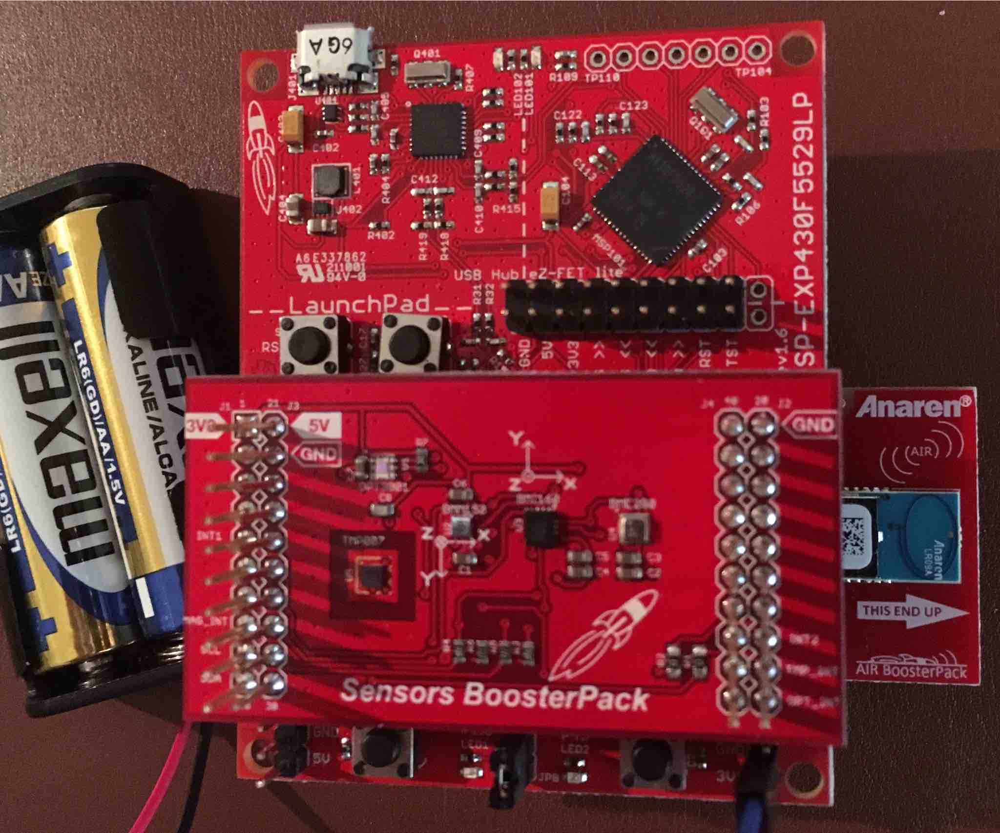

Battery Powered Outdoor Weather Sensor
======================================

This project is a battery-powered wireless outdoor weather sensor. It is designed to run on an MSP-EXP430G2 LaunchPad, 430BOOST-CC110L BoosterPack, and BOOSTXL-SENSORS BoosterPack, all from Texas Instruments.

Data from the TMP007, BME280, and OPT3001 sensors are periodically sent to a wireless receiver hub using the CC110L BoosterPack. A [receiver hub implementation](https://github.com/Andy4495/Wireless-Sensor-Receiver-Hub) is available on GitHub.

The project is designed for low-power operation. My current implementation is still running on a pair of AA batteries for over a year. The limiting factor in the life of the batteries is the TMP007 sensor, which is only specified to operate down to 2.5 V. The MSP430 (running at 8 MHz) will work down to 2.2 V, the BME280 sensor down to 1.8 V, and the OPT3001 sensor down to 1.6 V. 

Although not packaged into a library (yet), this project includes integer-only, software I2C interface code for the TMP007, OPT3001, and BME280 sensors. The code is broken into functions that can be used in other projects that need to interface with these sensors.

## Updated Design ##

Previous versions of the weather sensor were implemented for an MSP-EXP430F5529LP LaunchPad and used Rei Vilo's [Weather Sensors Library](https://github.com/rei-vilo/SensorsWeather_Library). However, that design required new batteries about every two months, so I looked for ways to cut power usage.

First off, I decided to move the design to the MSP430G2553 processor running at 8 MHz. Energia appears to support low power mode (with the `sleep()` and `sleepSeconds()` functions) on G2 processors better than on other variants. I did not do any research to confirm this; it is just an observation.

By moving to a G2553 controller, I had to switch to a software I2C implementation, since the G2 processors share hardware I2C with the SPI signals. I prefer my own software I2C implementation ([SWI2C](https://github.com/Andy4495/SWI2C)), so I had to re-work the interface to sensors on the SENSORS BoosterPack. While using the [Weather Sensors Library](https://github.com/rei-vilo/SensorsWeather_Library) as a starting point, my [interface code](./sensor_functions.ino) is a major rewrite. My SWI2C library does not use the standard `Wire` library calls, and Rei's library had a few issues that could result in incorrect sensor readings (e.g. lux measurement on the OPT3001 and configuration programming on the BME280). In addition, I changed the sensor configurations to use lower power modes.

I also changed all math operations to integer-only. Even though the sensor datasheets provide integer-only code (or a clear enough explanation of the data units so that floating point is not required), the sensor libraries from SparkFun, Adafruit, and Rei Vilo all use floating point operations unnecessarily. Note that it is also simple to convert from Celsius to Fahrenheit without using floating point code. Removing the floating point code saved about 4K of program space.

## Program details ##
The sketch collects the following data from the SENSORS BoosterPack:

- TMP007 Sensor:
     - Die temperature
     - External Temperature
- BME280 Sensor:
     - Temperature
     - Humidity
     - Pressure
- OPT3001 Sensor:
     - Lux

It also collects the following data from the MSP430:

- Die temperature
- Battery voltage (Vcc)

After collecting the sensor data, the data is packaged and transmitted to a receiver hub which can then further process and store the data over time.

All data is processed using integer math and is transmitted to the [receiver hub](https://github.com/Andy4495/Wireless-Sensor-Receiver-Hub) as follows:

- **Temperature** is formatted in tenth degrees Fahrenheit. For example, 733 represents 73.3 degrees Fahrenheit
- **Humidity** is formatted as tenth percent relative humidity. For example, 643 represents 64.3 % RH
- **Pressure** is formatted as hundredth inches of Mercury. For example, 3012 represents 30.12 inHg
- **Lux** is formatted as a long integer lux unit.

The compiled sketch currently takes about 15K of program space, and therefore fits on a G2553 controler. Further code reductions could be made by removing the `Serial.print` operations, which are currently only used for debugging.

## External Libraries ##
* [SWI2C](https://github.com/Andy4495/SWI2C) - Software I2C implementation.
* [Calibrated Temp and Vcc Library](https://github.com/Andy4495/MspTandV) - Internal MSP430 temperature and battery voltage measurements.

## References ##
* [TMP007](https://cdn-shop.adafruit.com/datasheets/tmp007.pdf) Temperature Sensor.
* [OPT3001](http://www.ti.com/lit/ds/symlink/opt3001.pdf) Amient Light Sensor.
* [BME280](https://ae-bst.resource.bosch.com/media/_tech/media/datasheets/BST-BME280_DS002.pdf) Temperature, Humidity, and Pressure Sensor.

## Assembled Weather Sensor ##
- 
Although pictured here with an F5529 LauchPad, the current implementation uses an MSP-EXP430G2 LaunchPad.
